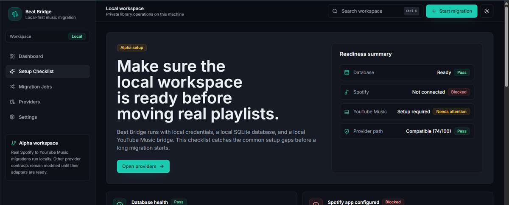
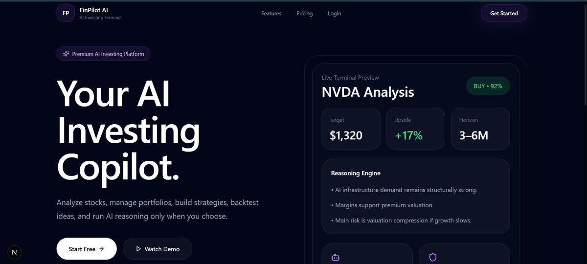
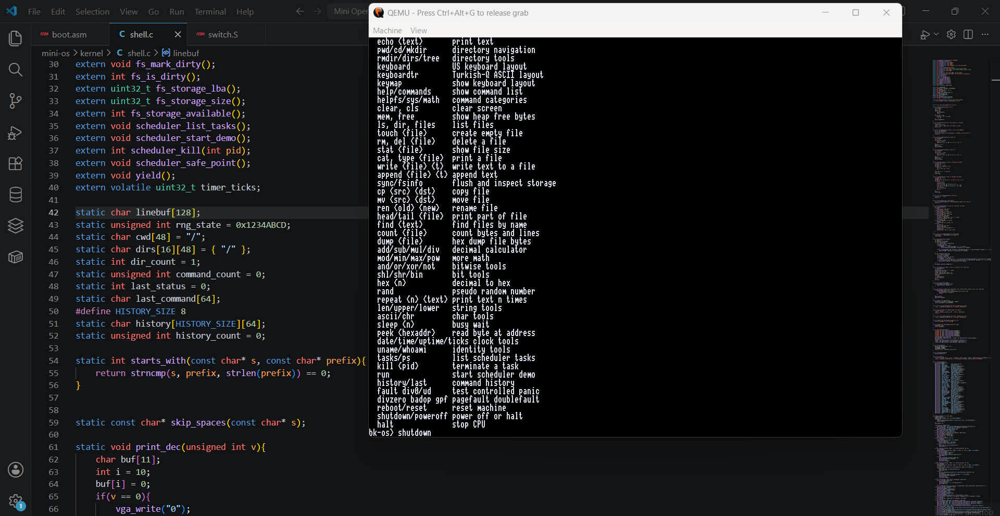
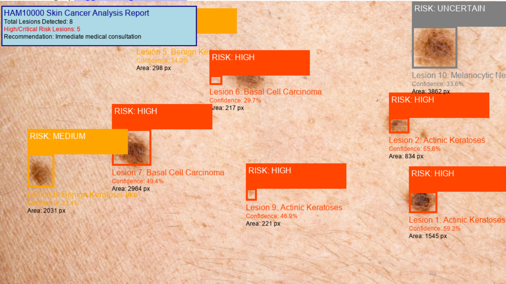

```md
<p align="center">
  
</p>

<h1 align="center">BAVER KOCA</h1>

<p align="center">
  Full-Stack Engineer • AI Builder • Systems Developer
</p>

<p align="center">
  Building products, not tutorials.
</p>

<p align="center">
  <a href="https://www.linkedin.com/in/baver-koca">
    
  </a>

  <a href="mailto:baverkoca999@gmail.com">
    
  </a>

  <a href="https://github.com/BaverKoca">
    
  </a>
</p>

---

# 🚀 Featured Projects

<table>
<tr>

<td width="50%">


### Beat Bridge

**Local-first music migration platform**

Move playlists between Spotify, YouTube Music and future providers while maintaining full ownership of your data.

**Stack**

`Next.js` `TypeScript` `SQLite` `Local-first`
</td>

<td width="50%">


### FinPilot AI

**AI Investing Terminal**

AI-powered investing platform inspired by Bloomberg Terminal and modern institutional tools.

**Stack**

`Next.js` `TypeScript` `AI` `Finance`
</td>

</tr>

<tr>

<td width="50%">


### BK-OS

**32-bit Operating System**

Operating system built from scratch with shell, scheduler, memory tools and low-level system components.

**Stack**

`C` `Assembly` `QEMU`
</td>

<td width="50%">


### Cancer Detector

**Computer Vision & Medical AI**

Skin lesion analysis system using computer vision and machine learning techniques.

**Stack**

`Python` `OpenCV` `Machine Learning`
</td>

</tr>
</table>

---

# 🛠 Core Stack

<p align="center">

</p>

---

# 📊 GitHub Stats

<p align="center">


</p>

<p align="center">


</p>

---

# 🎯 Currently Focused On

<table>
<tr>

<td width="25%">

### 🚀 Building

- Beat Bridge
- FinPilot AI
- New Products

</td>

<td width="25%">

### 🧠 Research

- Operating Systems
- Local AI
- Autonomous Driving
- Computer Vision

</td>

<td width="25%">

### 📚 Learning

- Advanced Systems
- AI Agents
- Cybersecurity
- Scalable Architectures

</td>

<td width="25%">

### 💎 Philosophy

- Build real products
- Ship software
- Learn by creating
- Prefer depth over hype

</td>

</tr>
</table>

---

# 📫 Connect

<p align="center">

<a href="https://www.linkedin.com/in/baver-koca">
LinkedIn
</a>

•

<a href="mailto:baverkoca999@gmail.com">
Email
</a>

</p>

---

<p align="center">
<b>Always building.</b>
</p>
```
