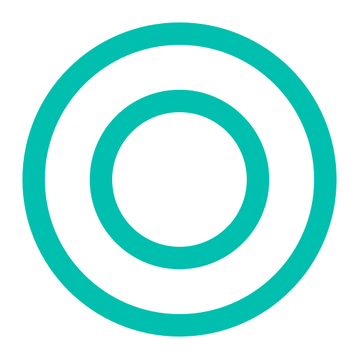
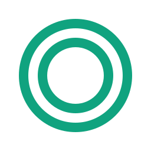
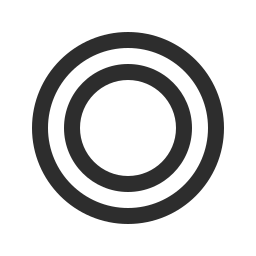

<!--
**BaverKoca/BaverKoca** is a ✨ _special_ ✨ repository because its `README.md` (this file) appears on your GitHub profile.

Here are some ideas to get you started:

- 🔭 I’m currently working on ...
- 🌱 I’m currently learning ...
- 👯 I’m looking to collaborate on ...
- 🤔 I’m looking for help with ...
- 💬 Ask me about ...(function() {
- 📫 How to reach me: ...
- 😄 Pronouns: ...
- ⚡ Fun fact: ...
-->

<div align="center">
  
</div>

<h1 align="center">Hi there 👋, I'm Baver Koca</h1>

<p align="center">
  <b>Computer Engineering Student | Cyprus</b><br>
  <i>Web, Mobile, Game Development & Machine Learning Enthusiast</i>
</p>

---

### 🚀 About Me

- 🎓 Computer Engineering student living in Cyprus  
- 🌱 Currently learning: Web, Mobile, Game Development, and Machine Learning  
- 🤝 Open to collaborating on new projects  
- 💬 Ask me about anything tech-related!

---

### 🛠️ Skills & Technologies

#### 👨‍💻 Programming Languages

<p align="center">
  
  
  
  
  
  
  
  
</p>

#### 🧰 Technologies & Tools

<p align="center">
  
  
  
  
  
  
  
  
  
  
  
  
  
  
  
</p>

#### 🤖 AI & Data Science

<p align="center">
  
  
  
  
  
  
  
  
  
<<<<<<< HEAD
  
  
  
  
=======
  
  
  
  
>>>>>>> 1e730e1 (added pictures)
</p>

---

### 📫 Contact

<p align="center">
  <a href="https://www.linkedin.com/in/baver-koca" target="_blank">
    
  </a>
  <a href="mailto:baver.koca00@gmail.com" target="_blank">
    
  </a>
</p>

---

<details>
<summary><strong>🌀 Spinning Donut — C Code Example</strong></summary>

```c
#include <stdio.h>
#include <math.h>
#include <string.h>
#include <unistd.h>

int main() {
    float A = 0, B = 0;
    int width = 80;
    int height = 22;
    float z[1760];
    char b[1760];

    printf("\x1b[2J");

    while (1) {
        memset(b, ' ', 1760);
        memset(z, 0, 1760 * sizeof(float));

        for (float theta = 0; theta < 2 * M_PI; theta += 0.07) {
            for (float phi = 0; phi < 2 * M_PI; phi += 0.02) {
                float sin_theta = sin(theta);
                float cos_theta = cos(theta);
                float sin_phi = sin(phi);
                float cos_phi = cos(phi);
                float sin_A = sin(A);
                float cos_A = cos(A);
                float sin_B = sin(B);
                float cos_B = cos(B);

                float R1 = 1;
                float R2 = 2;

                float circle_x = R2 + R1 * cos_theta;
                float circle_y = R1 * sin_theta;

                float x = circle_x * (cos_B * cos_phi + sin_A * sin_B * sin_phi) - circle_y * cos_A * sin_B;
                float y = circle_x * (sin_B * cos_phi - sin_A * cos_B * sin_phi) + circle_y * cos_A * cos_B;
                float z_coord = 5 + cos_A * circle_x * sin_phi + circle_y * sin_A;
                float ooz = 1 / z_coord;

                int xp = (int)(width / 2 + 30 * ooz * x);
                int yp = (int)(height / 2 - 15 * ooz * y);

                float L = cos_phi * cos_theta * sin_B - cos_A * cos_theta * sin_phi - sin_A * sin_theta + cos_B * (cos_A * sin_theta - cos_theta * sin_A * sin_phi);

                int luminance_index = (int)(L * 8);
                if (luminance_index >= 0 && xp >= 0 && xp < width && yp >= 0 && yp < height) {
                    int idx = xp + yp * width;
                    if (ooz > z[idx]) {
                        z[idx] = ooz;
                        const char luminance_chars[] = ".,-~:;=!*#$@";
                        b[idx] = luminance_chars[luminance_index > 11 ? 11 : luminance_index];
                    }
                }
            }
        }

        printf("\x1b[H");
        for (int k = 0; k < height * width; k++) {
            putchar(k % width ? b[k] : '\n');
        }

        A += 0.04;
        B += 0.02;
        usleep(30000);
    }

    return 0;
}
```
</details>
